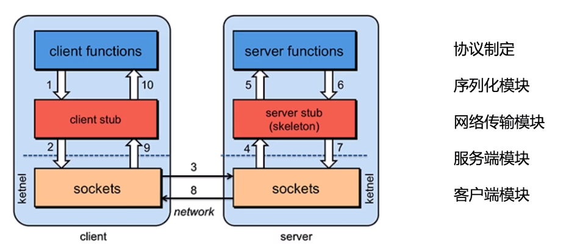

# NEO-RPC

## RPC框架

    
## 网络通信模块
 基于jetty, 实现HTTP短连接

### 服务端核心

1. 创建Jetty Server 实现网络监听
2. 基于Servlet进行网络处理,将ServletContextHandler注册到Jetty Server中
3. ServletHolder托管Servlet; RequestServlet负责数据的接受与数据的写回

### 客户端核心

 
- Proxy.newProxyInstance
    动态代理部分使用JDK提供的Proxy
- RemoteInvoker 
    主要去实现invoke方法
    1. 先构建需要往server发的Request对象
    2. 将此Request对象序列化为二进制,发送至服务端
    3. 服务端会写回一个Response对象
    
## 当前版本的不足
- 安全性

  数据是基于JSON序列化进行传输的,后期可以对序列化进行加密,
  网络通道未做校验与身份信息校验, 网络连接时可以做些身份认证。

- 服务端处理能力 

  目前服务端Transport是基于Jetty做的, 而Jetty Server端里面是具有线程池处理客户端的请求的
  (不过建议线程池还是自己去实现与管理), 线程跑完,返回数据的通道最好也是做成一个队列的形式
  
- 注册中心
  
  能够实现对于server地址的注册, client可以通过注册中心自动发现server的地址
  
- 集成能力
  如何与其他框架进行集成嵌入? 
  比如可以将他集成到比较流行的框架如SpringBoot,自动创建客户端/服务端,代理对象通过BeanFactory进行管理